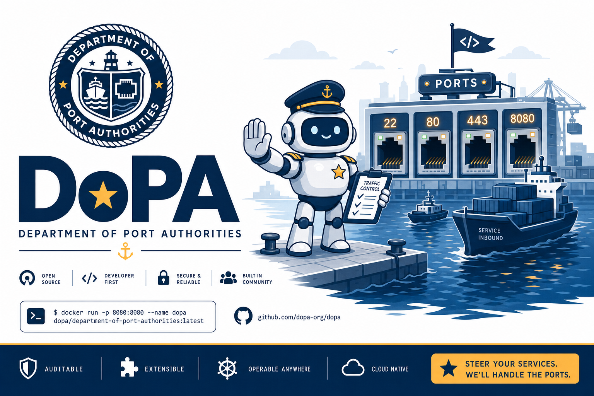
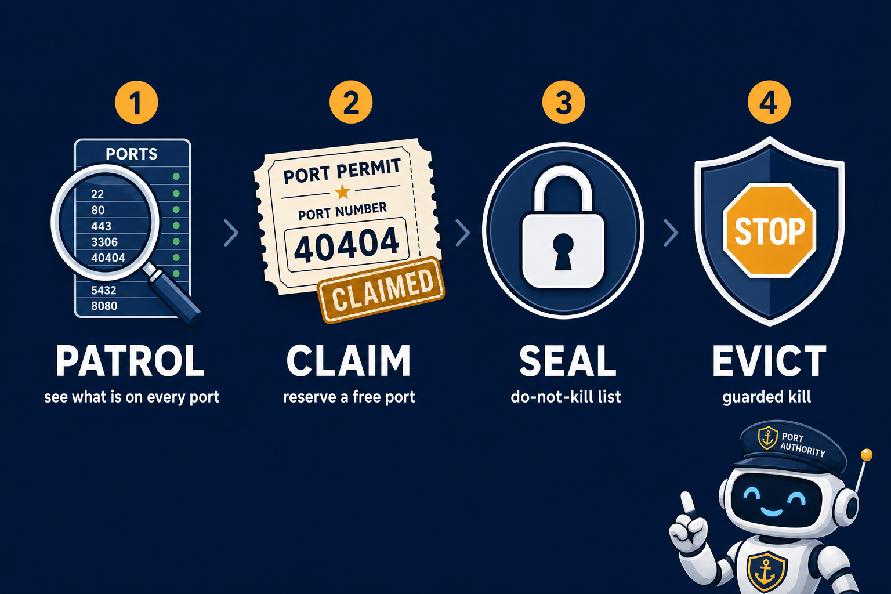

<div align="center">



# DoPA · Department of Port Authorities

**Track, protect, and clear your local-dev ports — so you (and your AI agents) stop killing each other's dev servers.**

[](LICENSE)
[](https://nodejs.org)


</div>

---

## Why DoPA exists

If you run more than one dev server — or more than one terminal, or a couple of AI coding agents at once — you've hit the **port 3000 traffic jam**: two things grab the same port, something blindly runs `kill-port 3000`, and it takes down a server that *wasn't* the problem.

DoPA is the **port authority** for your machine. It:

- **shows you what's actually on every port** (process, PID, and a best-guess service label like "Next.js dev"),
- keeps a **registry** so you can *reserve* a port for a project with a note,
- maintains a **do-not-kill list** (`seal`) so a protected port can't be killed by accident,
- and gives you a **guarded `evict`** that refuses to kill sealed, reserved, or system-critical ports unless you really mean it (`--force`).

<div align="center">

</div>

---

## Who is this for?

| You are… | DoPA gives you… |
|---|---|
| A dev juggling several projects/servers | One place to see and reserve ports, so they never fight over 3000 |
| Anyone who's rage-quit after `kill-port` nuked the wrong server | A guarded `evict` + a do-not-kill list |
| Someone running **AI coding agents** | A way for agents to `claim` ports and `patrol` before they bind/kill — instead of hardcoding 3000 |
| A team sharing conventions | A commit-able registry of who-owns-what-port |

---

## Install

```bash
# Once published:
npm install -g @robot-friends/dopa

# Today, straight from GitHub:
npm install -g github:Robot-Friends-Community/dopa

# Or clone + link for development:
git clone https://github.com/Robot-Friends-Community/dopa
cd dopa && npm link
```

Requires Node ≥ 18. No runtime dependencies. Works on macOS, Linux, and Windows (uses `lsof` / `ss` / `netstat` under the hood).

---

## Quick start

```bash
dopa patrol                              # what's listening right now?
dopa claim --project workbench           # get a safe, free port (and reserve it)
dopa seal 5432 --note "prod-like db"     # protect a port from accidental kills
dopa evict 3000                          # clear a port (guarded)
```

---

## Commands

### Inspect

| Command | What it does |
|---|---|
| `dopa patrol` · `scan` | List every listening port with PID, process, **service label**, and status. |
| `dopa inspect <port>` | Full detail for one port: who's live on it + its registry entry. |

### Registry — the records office

| Command | What it does |
|---|---|
| `dopa permit <port>` | Reserve a port. Flags: `--project <name>` `--note <text>`. |
| `dopa revoke <port>` | Release a reservation. |
| `dopa registry` · `ls` | Show the registry (reserved + sealed) alongside live state. |
| `dopa claim` | Find the first free, unreserved port in a band and reserve it. Flags: `--range 40400-40499` `--project` `--note` `-q`. |

### Protect — the do-not-kill list

| Command | What it does |
|---|---|
| `dopa seal <port>` | Add a port to the do-not-kill list. Flag: `--note <text>`. |
| `dopa unseal <port>` | Remove a port from the do-not-kill list. |
| `dopa evict <port>` | **Guarded kill.** Refuses sealed, reserved, or system-critical ports unless `--force`. |

### Flags

| Flag | Applies to | Effect |
|---|---|---|
| `--force`, `-f` | `evict` | Override the guard and kill anyway. |
| `--json` | `patrol`, `registry` | Machine-readable output. |
| `--quiet`, `-q` | `claim` | Print only the bare port number (for scripting). |
| `--help`, `-h` · `--version`, `-v` | any | Help / version. |

---

## Examples

**Never think about a port again** — claim one and start your server on it:

```bash
PORT=$(dopa claim -q --project workbench) && next dev -p $PORT
```

**Protect your database from a stray `kill`:**

```bash
dopa seal 5432 --note "local Postgres — do not touch"
dopa evict 5432            # ✗ refused: :5432 is SEALED (do-not-kill)
dopa evict 5432 --force    # only if you really mean it
```

**See the whole board, including what you've reserved:**

```bash
dopa registry
# PORT   STATUS      PROJECT    NOTE                 LIVE
# 40404  🔒 SEALED   workbench  GP dev — don't kill  ● node
# 40410  ◆ RESERVED  api        —                    · not running
```

---

## How it stores things

The registry is a single JSON file at **`~/.dopa/registry.json`** (override with the `DOPA_HOME` env var). It's plain, human-readable, and safe to commit to a dotfiles repo or share across a team.

### The recommended convention

Pick **uncommon, fixed ports per project** and stay out of the commonly-jammed ones (3000, 4000, 5000, 5173, 8000, 8080, 8888). DoPA's `claim` defaults to the **`40400-40499`** band — high enough to avoid the usual suspects, below the OS ephemeral range, and easy to remember.

---

## For AI coding agents

DoPA is built for a world where humans *and* agents share a machine. Agents should:

1. `dopa claim -q` to get a port instead of hardcoding 3000,
2. `dopa patrol --json` to see what's running before binding or killing,
3. **never** blanket-kill (`taskkill /F /IM node.exe`, `kill-port 3000`) — use `dopa evict`, which respects the do-not-kill list.

---

## Repo structure

```
dopa/
├── bin/dopa.js          # CLI entry point
├── src/
│   ├── cli.js           # arg parsing + every command handler
│   ├── ports.js         # cross-platform listening-port discovery (pure parsers + exec)
│   ├── registry.js      # the persistent registry (~/.dopa/registry.json)
│   ├── services.js      # port/process → service label + system-process detection
│   └── format.js        # tiny zero-dep ANSI + table helpers
├── test/dopa.test.js    # node --test suite (parsers, services, registry)
├── assets/              # README images
└── README.md
```

## Contributing

PRs welcome — it's a small, readable, zero-dependency codebase. See
**[CONTRIBUTING.md](CONTRIBUTING.md)** for setup, branch flow, and conventions
(the short version: branch off `dev`, keep it dependency-free, and `npm test`
must pass). Be excellent to each other — [Code of Conduct](CODE_OF_CONDUCT.md).

## Credits

DoPA stands on the shoulders of two excellent MIT-licensed tools:

- **[portcop](https://github.com/Hawila/portcop)** — the cross-platform listening-port discovery + kill strategy.
- **[portrm](https://github.com/abhishekayu/portrm)** — the idea of per-port service identification and safety tiers.

DoPA's contribution is bringing those together with a **persistent registry**, a **do-not-kill list**, and a **guarded evict** in one tool.

---

<div align="center">

Built by **[Robot Friends](https://github.com/Robot-Friends-Community)** · MIT Licensed

*A community of builders, tinkerers, and AI enthusiasts. Tools, projects, and good vibes.*

</div>
